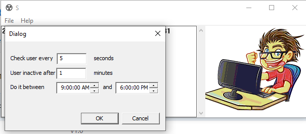

Windows app that prevents the system going into sleep/lock/screen saver state by simulating user activity.

Developed with VS2019 on top of raw win32.

The app simulates a NumLock keystroke when user activity is not detected, thus preventing the system to go into sleep/lock/screen saver state and kepp the monitor always open.
You also have the option to set a time interval during which the app will do the job.

